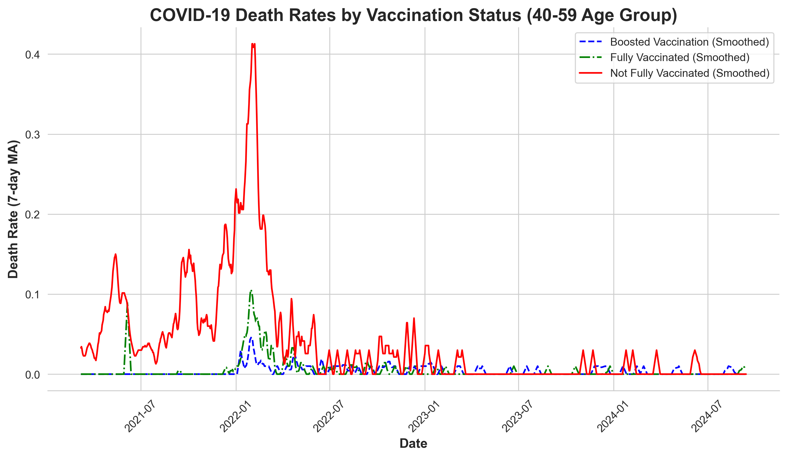

# COVID-19 Death Rates Analysis by Vaccination Status

## Overview
This project analyzes COVID-19 death rates by vaccination status using publicly available data from the Ontario Data Catalogue. Dataset includes death rates for different vaccination statuses over time.
